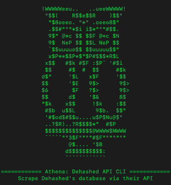

# Athena
### Dehashed API CLI

### Framework to interact with Dehashed's API from the commandline. 
Requirements:
 
    1) Modules: requests, numpy
    2) Python version 3.6 or higher

### To install all required modules, run the following command after git cloning:

<pre><code>pip3 install -r requirements.txt
</code></pre>

## Who is Athena for?

This tool was built in order to help PenTesters carry out credential stuffing attacks, or for SysAdmins/Internal Security Teams to monitor who in their company is vulnerable to such attacks.

## How to use

The help pages (-h or --help) gives all the details needed to properly utilise this tool, as shown below.

If using the list generated by the -w/--wordlist switch with BurpSuite, then the following steps should be taken

1) Use attack type: pitchfork
2) Paste full the wordlist of “username:password" into both payload sections
3) Set a payload processing rule of “Match/Replace”. 
4) For username payload set the regex to :(.\*)
5) For password payload set the regex to this   ^[^:]+:\s*

**NB:** If passing solely the domain, do not put the '\*@' in front of it, as this may break the searches.
